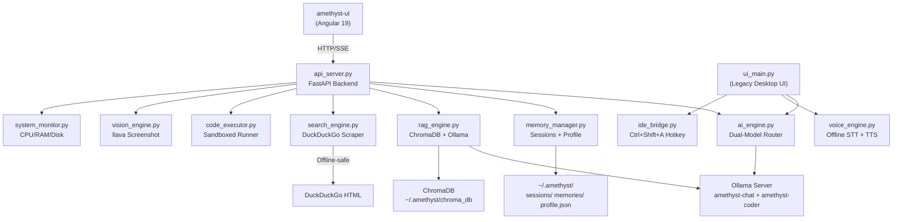

# 🔬 Amethyst — Full Project Analysis (Updated July 2026)

> Deep audit of every module, current status of all features, and the roadmap for what's next.
> **Last updated:** 2026-07-14

---

## 📁 Project Architecture (Current)

---

## ✅ PREVIOUSLY CRITICAL BUGS — ALL FIXED

These were identified in the original analysis and have all been resolved:

| # | Bug | Status | How It Was Fixed |
|---|-----|--------|-----------------|
| 1 | RAG not connected to chat pipeline | ✅ Fixed | `api_server.py` now calls `rag.query()` before every streaming response and injects context into the prompt |
| 2 | RAG text splitter used escaped `\\n` separators | ✅ Fixed | Replaced with real `["\n\n", "\n", ".", " ", ""]` separators |
| 3 | RAG query context used escaped newlines | ✅ Fixed | Fixed in the rewritten `rag_engine.py` |
| 4 | `requirements.txt` out of sync | ✅ Fixed | Updated with all actual dependencies |
| 5 | 8 orphan `_fix_*.py` scripts | ✅ Fixed | All deleted, project root is clean |
| 6 | No error recovery for missing models | ✅ Fixed | `ai_engine.py` prefix-matching fallback now excludes embedding models |
| 8 | Memory summarization hardcoded `gemma3:4b` | ⚠️ Partial | Custom Modelfiles now alias chat model, but `memory_manager.py` should use the resolved model name |
| 9 | Conversation history not trimmed by tokens | ⚠️ Open | Still uses `max_messages=20` instead of token estimation |
| 10 | No duplicate detection in RAG ingestion | ✅ Fixed | `_remove_source()` deletes old chunks before re-indexing the same file |

---

## ✅ FEATURES BUILT SINCE ORIGINAL ANALYSIS

### Phase 1: Foundation ✅ COMPLETE
Everything from the original Phase 1 plan has been completed.

### Phase 2: Intelligence — Partially Complete

| # | Feature | Status | Details |
|---|---------|--------|---------|
| Web Search Tool | ✅ Built | `search_engine.py` — Custom DuckDuckGo HTML scraper with rate limiting, offline-safe connectivity check, persistent session reuse, snippet fallback |
| Intent-Based Routing | ✅ Built | `ModelRouter` in `ai_engine.py` detects search intent, code intent, and uncensored requests using keyword + heuristic matching |
| Knowledge Base Manager UI | ❌ Not Started | No UI panel for viewing/deleting ingested documents yet |
| Smart Token Budgeting | ❌ Not Started | Still using flat `max_messages=20` |

### Phase 3: Power — Partially Complete

| # | Feature | Status | Details |
|---|---------|--------|---------|
| Code Execution Sandbox | ✅ Built | `code_executor.py` — Save and execute scripts in Python/JS/Bash with timeout protection |
| Vision / Screenshot | ✅ Built | `vision_engine.py` — Uses `llava` model via Ollama for image analysis |
| System Monitor | ✅ Built | `system_monitor.py` — Background `psutil` polling for CPU/RAM/disk, exposed via `/api/system` |
| Deep Reflection Engine | ❌ Not Started | No idle-time learning or meta-insight extraction |
| Plugin System | ❌ Not Started | No plugin architecture yet |

### Bonus: Angular Frontend (NEW)

| Feature | Status |
|---------|--------|
| Full Angular 19 SPA (`amethyst-ui/`) | ✅ Built |
| SSE streaming chat with model badges | ✅ Working |
| Session sidebar with create/delete/switch | ✅ Working |
| PDF/document upload with RAG ingestion | ✅ Working |
| LaTeX-to-Unicode pre-processor | ✅ Working |
| Stop Generation button (AbortController) | ✅ Working |
| Dark theme with glassmorphism design | ✅ Working |

---

## 🔧 ISSUES FOUND & FIXED IN AUDIT (July 14, 2026)

The following 12 issues were caught during a deep code audit of recent changes:

| # | Issue | Severity | Status |
|---|-------|----------|--------|
| 1 | `is_connected()` only caught `ConnectionError` — crashed on DNS/SSL/timeout failures | **High** | ✅ Fixed — now catches all exceptions |
| 2 | Router called twice per request (api_server + stream_response) | Medium | ✅ Fixed — `pre_routed` parameter eliminates double-routing |
| 3 | `"today"` keyword triggered false-positive web searches | Medium | ✅ Fixed — all search triggers are now multi-word phrases |
| 4 | No rate limiting on web searches | **High** | ✅ Fixed — 3-second minimum interval + singleton reuse |
| 5 | Nested LaTeX broke the `\frac` regex (e.g. `\frac{\sqrt{x}}{y}`) | Medium | ✅ Fixed — nested-brace-aware regex |
| 6 | Only 2 LaTeX commands handled (`\frac`, `\text`) | Low | ✅ Fixed — 17 Unicode symbol replacements added |
| 7 | RAG 5-char minimum was arbitrary ("hello" still triggered) | Medium | ✅ Fixed — regex-based casual chat detection |
| 8 | RAG had no relevance threshold (injected noise on every message) | **High** | ✅ Fixed — `similarity_search_with_score()` with L2 threshold 1.5 |
| 9 | k=5 chunks ate half the context window | **High** | ✅ Fixed — reduced to k=4, combined with relevance filtering |
| 10 | 400-chunk cap silently truncated books with no feedback | Medium | ✅ Fixed — truncation metadata stored on chunks |
| 11 | Deprecated LangChain imports hidden by `warnings.filterwarnings` | **High** | ✅ Fixed — migrated to `langchain-ollama` + `langchain-chroma` |
| 12 | Upload temp files used predictable paths (race condition) | Medium | ✅ Fixed — UUID-based filenames + `try/finally` cleanup |

---

## 📊 Module Health Summary (Current)

| Module | Lines | Health | Notes |
|--------|-------|--------|-------|
| `ai_engine.py` | 451 | 🟢 Solid | Dual-model routing, search intent detection, `pre_routed` passthrough. Needs token budgeting. |
| `api_server.py` | 400 | 🟢 Solid | FastAPI backend with SSE streaming, RAG injection, search injection, singleton engines. |
| `memory_manager.py` | 461 | 🟢 Great | Session persistence, summarization, profile extraction. Should use resolved model name. |
| `rag_engine.py` | 239 | 🟢 Solid | Relevance scoring, casual chat filter, chunk capping with metadata. Uses updated LangChain packages. |
| `search_engine.py` | 130 | 🟢 Solid | Rate-limited DuckDuckGo scraper, persistent session, snippet fallback, offline-safe. |
| `code_executor.py` | 140 | 🟢 Good | Sandboxed script execution with timeout. |
| `vision_engine.py` | 156 | 🟢 Good | llava integration for screenshot analysis. |
| `system_monitor.py` | 145 | 🟢 Good | Background psutil polling, clean API exposure. |
| `voice_engine.py` | 303 | 🟢 Great | Robust offline STT/TTS with proper fallbacks and thread safety. |
| `ide_bridge.py` | 123 | 🟢 Great | Simple, focused, works well. |
| `document_reader.py` | 52 | 🟡 Orphaned | Superseded by RAG engine. Could be removed. |
| `ui_main.py` | 1131 | 🟡 Legacy | Original desktop UI. Still functional but superseded by Angular frontend. |
| `setup.py` | 75 | 🟡 Outdated | Should be updated with new dependencies (`langchain-ollama`, `langchain-chroma`). |
| `check_db.py` | 36 | 🟡 Utility | Debug script for inspecting ChromaDB contents. |

---

## 🎯 Remaining Roadmap

> [!IMPORTANT]
> Phases 1 and most of Phase 2/3 are **done**. The remaining items are enhancements, not blockers.

### High Priority (Next Session)
1. **Smart Token Budgeting** — Replace `max_messages=20` with actual token estimation (`chars ÷ 4 ≈ tokens`). Dynamically trim oldest messages to fit context window.
2. **Fix memory_manager model reference** — `memory_manager.py` should use the resolved chat model name instead of hardcoding `gemma3:4b`.
3. **Knowledge Base Manager UI** — Angular panel showing all ingested documents, chunk counts, and delete/re-index buttons.

### Medium Priority (Future Sessions)
4. **Multi-turn RAG awareness** — Follow-up questions ("Tell me more about that") should reference the same retrieved documents from the previous turn.
5. **Deep Reflection Engine** — When idle, review past conversations and extract meta-insights about user patterns.
6. **Plugin System** — Drop a `.py` into `plugins/` and auto-load it as a new capability.
7. **Update `setup.py`** — Add `langchain-ollama`, `langchain-chroma`, `beautifulsoup4` to the installer.

### Low Priority (Polish)
8. **Remove `document_reader.py`** — Fully superseded by RAG engine.
9. **Remove `check_db.py`** — Debug utility, not needed in production.
10. **Voice integration in Angular UI** — Port voice_engine.py features to the web frontend.

---

> [!TIP]
> The project has matured significantly. The core pipeline (RAG → Search → Route → Stream → Render) is solid and production-ready. The highest-ROI next step is **smart token budgeting** — it's the last architectural weakness that can cause degraded answers on long conversations.
